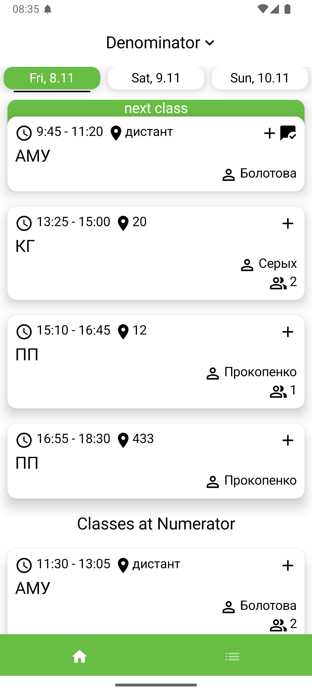
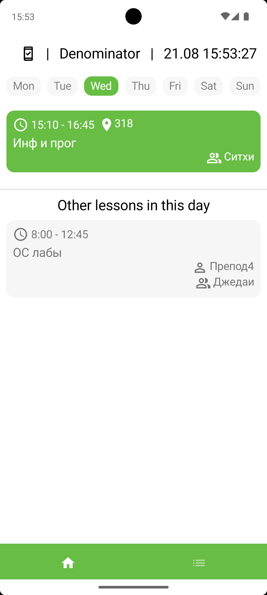
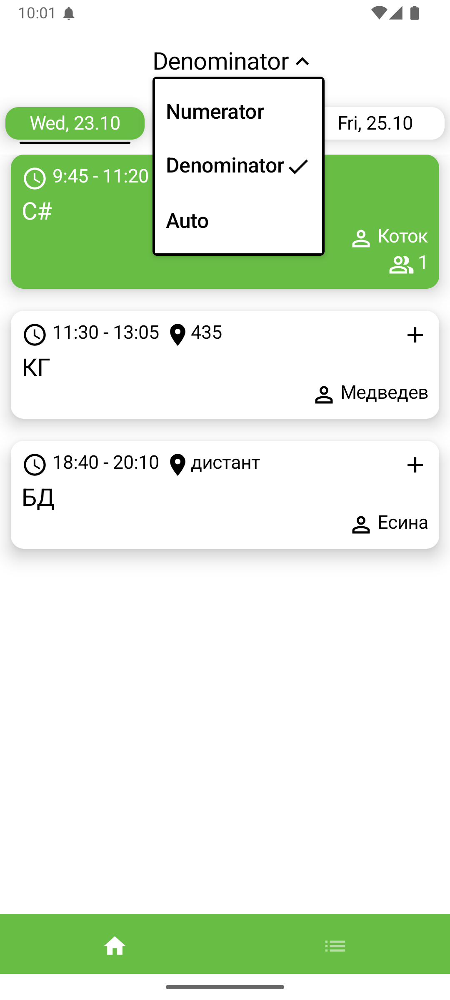
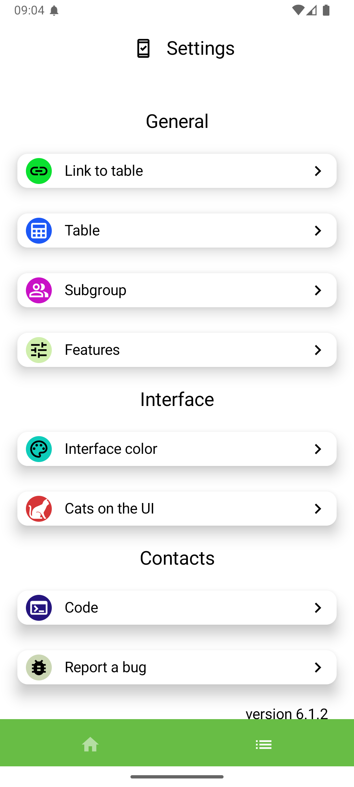
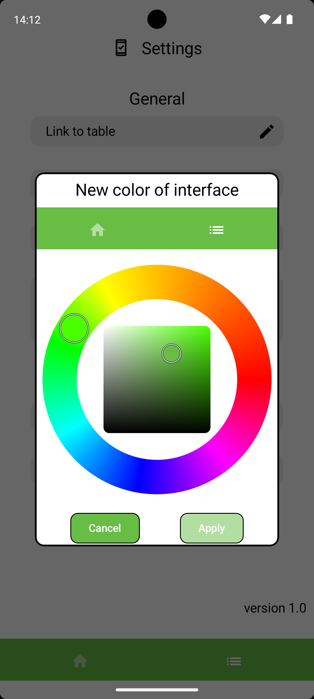
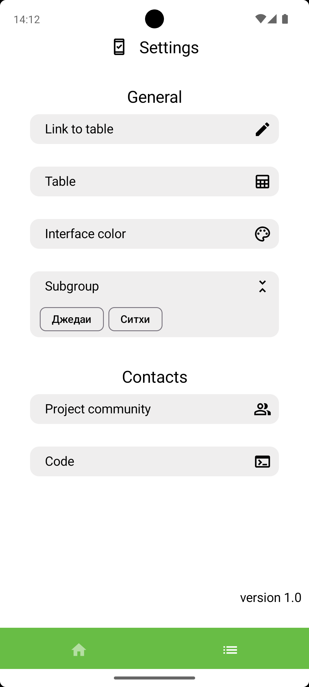
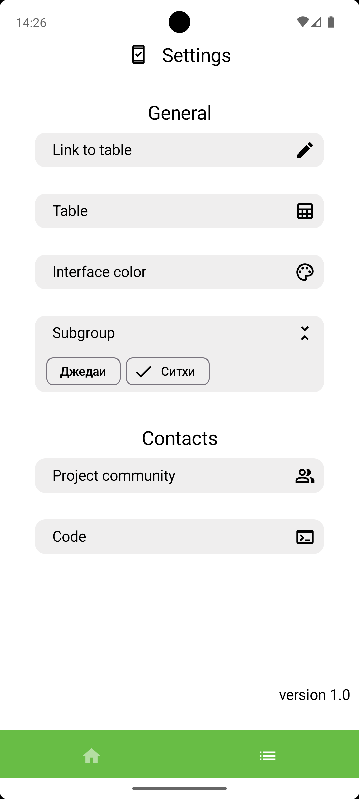
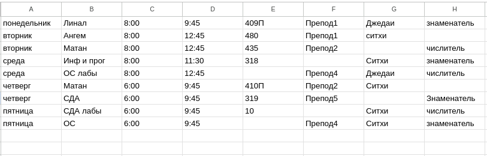

# University schedule

Simple scheduler application.

Works by creating a connection between *Google Sheets* and the *App* itself.

## Features

Controlled notifications 15 minutes before lesson for a week in advance

Supported languages: English, Russian

Supported themes: Dark, Light

### Main screen

- Shows you all of the classes for each day
- Indicates what class is going on right now and what will be the next one
- If you’ve chosen a subgroup in *settings*, it will show you only this subgroup's classes; otherwise — all classes
- You can manually change the frequency and it will be displayed like that until you change it again. Auto - frequency calculation depends on the week number of the year.

### Settings screen

#### General

- Link your schedule with Google Sheets
- Open your spreadsheet in browser or Google Sheets App
- Change interface color by ColorPicker
- Choose subgroup  

#### Contacts

- Community in VK.com
- Code on GitHub

#### Color picker

- You can change the main color separately in Dark and Light themes.

#### Subgroup

    
    

## Google Sheets integration
Your spreadsheet should contain 8 columns(from A to H)

Fields:
- **A — day of the week**
- B — subject name
- **C — starting time**
- **D — ending time**
- E — classroom
- F — teacher
- G — subgroup
- H — frequency

Fields A,C,D are *required*, don't leave them undefined 

- if column E (classroom) is undefined -> it won’t be shown
- if column F (teacher) is undefined -> it won’t be shown
- if column G (subgroup) is undefined -> this class will be shown for all subgroups
- if column H (frequency) is undefined -> this class will show up every week

**Example:**

## Usage

How to link your schedule to the App:
1. Your spreadsheet should have general access set to **anyone with the link**
2. Copy spreadsheet's link
3. Paste in App's *settings* menu
   
## Download

[You can find latest release here](https://github.com/vafeen/UniversitySchedule/releases)
