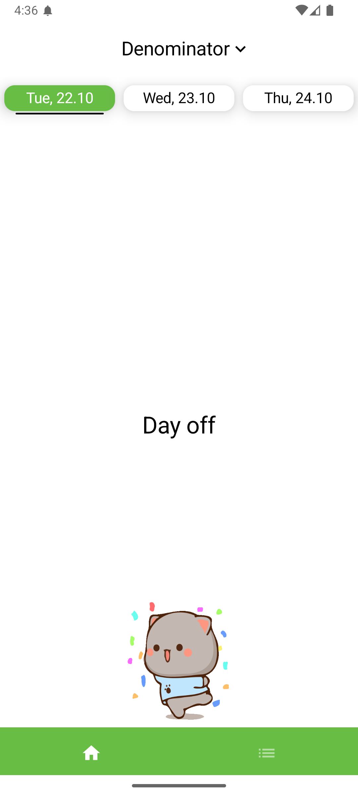

# University Schedule
#### Easily track your university classes with this simple scheduler app.

## Navigation
* [Installation](#installation)
* [Features](#features)
* [Getting Started](#getting-started)

## Installation
Follow these simple steps:
1. Download the `.apk` file from [releases](https://github.com/vafeen/UniversitySchedule/releases) (or just click [this](https://github.com/vafeen/UniversitySchedule/releases/latest/download/app-release.apk))
2. Approve the installation of the software on your device
3. Have fun!

## Features
- Supported languages: **English**, **Russian**
- Supported themes: **Dark**, **Light**
- Works by creating a connection between **Google Sheets** and the **App** itself.
- Notifications 15 mins before a class for a week in advance

### Main screen
- Shows you all of the classes for each day
- Indicates what class is going on right now and what will be the next one
- If you’ve chosen a subgroup in **settings**, it will show you only this subgroup's classes; otherwise — all classes
- You can also use the numerator/denomirator logic if your class has 2-week frequency

### Settings screen
#### General
- Link your schedule to **Google Sheets**
- Open your spreadsheet in browser or through **Google Sheets**
- Choose subgroup

#### Interface 
- Change interface color
- Turn on/off cute cats

#### Contacts 
- App's code on **Github**
- Report a bug via **gmail**

## Getting Started
### Usage
How to link your schedule to our **App**:
1. Your spreadsheet should have general access set to **anyone with the link**
2. Copy spreadsheet's link
3. Paste in App's *settings* menu

### How to organize your spreadsheet
Your spreadsheet should contain 8 columns (from A to H)

Fields:
- **A — day of the week**
- B — subject name
- **C — starting time**
- **D — ending time**
- E — classroom
- F — teacher
- G — subgroup
- H — frequency

Fields A,C,D are **required**, don't leave them undefined! 

- if column E (classroom) is undefined, then it won’t be shown
- if column F (teacher) is undefined, then it won’t be shown
- if column G (subgroup) is undefined, then this class will be shown for all subgroups
- if column H (frequency) is undefined, then this class will show up every week

**Example:**

